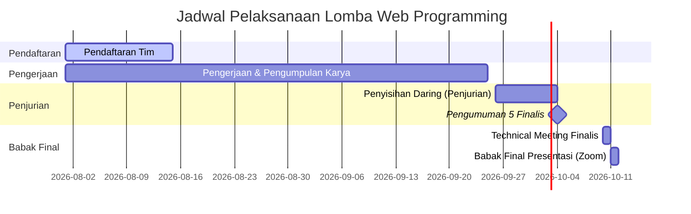

# Konsep Kompetisi Web Programming — PARTI UMS

Dokumen ini berisi rancangan konsep lengkap untuk penyelenggaraan **Lomba Web Programming Tingkat Nasional** pada event **PARTI (Parade Teknik Informatika)** yang diselenggarakan oleh **HIMATIF UMS**.

---

## 1. Struktur Formulir Pendaftaran (Google Form)

Untuk mempermudah validasi data panitia, formulir pendaftaran dibagi menjadi **3 Bagian Utama** dengan validasi isian yang ketat.

### Bagian 1: Informasi Dasar & Kategori Peserta
*   **Nama Tim / Individu** (Teks Jawaban Singkat)
    *   *Keterangan:* Jika mendaftar sebagai individu, masukkan nama lengkap.
*   **Kategori Pendaftaran** (Pilihan Ganda)
    *   `[ ] Individu (1 Orang) — HTM Rp 35.000`
    *   `[ ] Tim (2-4 Orang) — HTM Rp 70.000`
*   **Asal Perguruan Tinggi / Universitas** (Teks Jawaban Singkat)
*   **Nama Ketua / Peserta Individu** (Teks Jawaban Singkat)
*   **Nomor WhatsApp Ketua (Aktif)** (Teks Jawaban Singkat, Validasi: Hanya Angka)
*   **Email Ketua (Aktif)** (Teks Jawaban Singkat, Validasi: Format Email)

### Bagian 2: Informasi Anggota (Dinamis Sesuai Jumlah Anggota)
*   **Jumlah Anggota Tim Lainnya (Tidak Termasuk Ketua)** (Pilihan Ganda untuk Navigasi Halaman)
    *   `[ ] 1 Anggota Tambahan (Total Tim 2 Orang)`
    *   `[ ] 2 Anggota Tambahan (Total Tim 3 Orang)`
    *   `[ ] 3 Anggota Tambahan (Total Tim 4 Orang)`
*   *Aturan Navigasi Halaman Dinamis (Go to Section based on Answer):*
    *   **Pilihan 1:** Arahkan ke Halaman Isian **Nama Anggota 1** (Wajib).
    *   **Pilihan 2:** Arahkan ke Halaman Isian **Nama Anggota 1** & **Nama Anggota 2** (Keduanya Wajib).
    *   **Pilihan 3:** Arahkan ke Halaman Isian **Nama Anggota 1**, **Nama Anggota 2**, & **Nama Anggota 3** (Ketiganya Wajib).

### Bagian 3: Berkas Administrasi & Pembayaran
*   **Kartu Tanda Mahasiswa (KTM) / Kartu Hasil Studi (KHS)** (Unggah Berkas / File Upload)
    *   *Keterangan:* Wajib menggabungkan KTM seluruh anggota tim dalam satu berkas PDF atau archive (ZIP), maksimal 10MB.
*   **Surat Pernyataan Orisinalitas Karya dan Kesediaan Mengikuti Perlombaan** (Unggah Berkas / File Upload)
    *   *Keterangan:* Template berkas dapat diunduh di `[Link Detail Sub-Event]`. Format: PDF.
*   **Bukti Pembayaran Pendaftaran** (Unggah Berkas / File Upload, Format Gambar: JPG/PNG)
    *   *Keterangan:* Unggah bukti transfer sesuai kategori pendaftaran.
    *   *Rekening Tujuan:* Bank Mandiri - 1234567890 a.n. Bendahara HIMATIF UMS (atau metode e-wallet).
*   **Sumber Informasi Lomba** (Pilihan Ganda / Kotak Centang)
    *   `[ ] Instagram @himatifums / @parti.ums`
    *   `[ ] Grup WhatsApp/Telegram Mahasiswa`
    *   `[ ] Pamflet Mading Kampus`
    *   `[ ] Rekomendasi Dosen/Teman`
    *   `[ ] Lainnya (tuliskan...)`

---

## FORMULIR PENGUMPULAN KARYA
### Lomba Web Programming — PARTI UMS

#### Deskripsi Formulir (Tulis di bagian atas form):
> Halo Peserta Lomba Web Programming PARTI UMS!
> 
> Silakan lengkapi formulir pengumpulan karya di bawah ini sebelum batas akhir pengumpulan pada **25 September 2026 pukul 23:59 WIB**.
> 
> *Catatan:* Pastikan tautan repositori GitHub diatur ke status **Public** dan tautan video YouTube diatur ke status **Public / Unlisted** (bukan Private) agar dapat dinilai oleh Dewan Juri.

### BAGIAN 1: IDENTITAS & VERIFIKASI PESERTA
1.  **Email Ketua / Perwakilan Tim** (Teks Jawaban Singkat)
    *   *Keterangan:* Untuk mengirimkan tanda terima pengumpulan.
    *   *Validasi:* Aktifkan pengumpulan email otomatis (Settings Google Form).
2.  **Nomor Registrasi Tim** (Teks Jawaban Singkat)
    *   *Keterangan/Contoh:* Masukkan kode registrasi unik yang telah diberikan panitia setelah konfirmasi pembayaran (Contoh: **WEB-007**).
    *   *Validasi:* Wajib Diisi (Required).
3.  **Nama Tim / Individu** (Teks Jawaban Singkat)
    *   *Keterangan:* Masukkan Nama Tim atau Nama Lengkap Anda jika mendaftar sebagai Individu secara eksak sesuai saat pendaftaran awal.
    *   *Validasi:* Wajib Diisi (Required).
4.  **Asal Perguruan Tinggi / Universitas** (Teks Jawaban Singkat)
    *   *Validasi:* Wajib Diisi (Required).
5.  **Nomor WhatsApp Ketua (Aktif)** (Teks Jawaban Singkat)
    *   *Keterangan:* Nomor yang bisa dihubungi untuk konfirmasi karya jika ada tautan yang rusak/tidak dapat dibuka.
    *   *Validasi:* Hanya Angka, Wajib Diisi (Required).

### BAGIAN 2: DETAIL PROYEK & KARYA
6.  **Nama Aplikasi Web / Judul Karya** (Teks Jawaban Singkat)
    *   *Keterangan:* Nama dari aplikasi web produktivitas yang kalian bangun.
    *   *Validasi:* Wajib Diisi (Required).
7.  **Sub-Tema yang Dipilih** (Pilihan Ganda)
    *   `[ ] Academic & Research Assistant Tools`
    *   `[ ] Time & Task Management`
    *   `[ ] Mental & Physical Well-Being Tracker`
    *   *Validasi:* Wajib Diisi (Required).
8.  **Deskripsi Singkat Aplikasi** (Paragraf / Teks Jawaban Panjang)
    *   *Keterangan:* Jelaskan secara singkat masalah yang diselesaikan dan fitur utama dari aplikasi web Anda (Maksimal 150-200 kata).
    *   *Validasi:* Wajib Diisi (Required).

### BAGIAN 3: TAUTAN PENGUMPULAN KARYA
9.  **Tautan Repositori GitHub (Source Code)** (Teks Jawaban Singkat)
    *   *Keterangan:* Pastikan repositori sudah di-set ke **Public** dan di dalamnya terdapat file `README.md` yang lengkap.
    *   *Validasi:* Format Tautan/URL, Wajib Diisi (Required).
10. **Tautan Live Demo Website** (Teks Jawaban Singkat)
    *   *Keterangan:* Tautan web yang sudah dideploy secara online (Contoh: `https://namaproyek.vercel.app` atau `https://namaproyek.netlify.app`).
    *   *Validasi:* Format Tautan/URL, Wajib Diisi (Required).
11. **Tautan Video Demonstrasi Aplikasi (YouTube / Google Drive)** (Teks Jawaban Singkat)
    *   *Keterangan:* Tautan video berdurasi 3-5 menit yang diunggah ke YouTube atau Google Drive. Pastikan visibilitas video di-set ke **Public** atau **Unlisted**.
    *   *Validasi:* Format Tautan/URL, Wajib Diisi (Required).

---

## 2. Draft Buku Panduan (Guidebook)

### A. Deskripsi Umum & Tema
Kompetisi Web Programming PARTI UMS menantang mahasiswa aktif tingkat nasional untuk merancang dan membangun aplikasi web berbasis prototipe yang berfungsi (*functional prototype*) guna memecahkan masalah produktivitas mahasiswa dalam lingkup akademik, manajemen waktu, kolaborasi, maupun kesejahteraan mahasiswa.

*   **Tema Utama:** *"Forging Digital Productivity: Crafting Web Solutions for a New Renaissance."*
*   **Sub-Tema Pilihan** *(Peserta dibebaskan mengeksplorasi ide sekreatif mungkin sesuai sub-tema berikut):*
    1.  **Academic & Research Assistant Tools**: Seperti, Alat bantu belajar, pencarian referensi, pencatatan efektif, dll.
    2.  **Time & Task Management**: Seperti, Manajemen tugas, jadwal kuliah, kolaborasi tim belajar, dll.
    3.  **Mental & Physical Well-Being Tracker**: Seperti, Pemantauan kesehatan mental, pola tidur, dan produktivitas sehat, dll.

### B. Persyaratan & Aturan Teknis
1.  **Status Peserta**: Mahasiswa aktif (D3/D4/S1) di seluruh perguruan tinggi Indonesia dibuktikan dengan KTM/KHS aktif.
2.  **Komposisi Tim**: 1 orang (Individu) atau 2-4 orang (Tim) Mahasiswa umum.
3.  **Teknologi Web**:
    *   Peserta dibebaskan menggunakan kerangka kerja (*framework*) Frontend/Backend apa pun (React, Vue, Laravel, Next.js, Node.js, TailwindCSS, Bootstrap, dll.).
    *   Dilarang menggunakan CMS instan (WordPress, Joomla, Wix, dll.) atau No-Code tools yang tidak memerlukan pemrograman.
4.  **Hak Cipta**: Karya harus orisinal, belum pernah memenangkan lomba sejenis, dan bebas dari isu hak cipta pihak ketiga.

### C. Mekanisme Pengumpulan Karya (Babak Penyisihan)
Peserta wajib mengumpulkan:
1.  **Tautan Repositori GitHub**: Berisi source code rapi dengan dokumentasi file `README.md` yang menjelaskan cara menjalankan aplikasi secara lokal dan teknologi yang digunakan.
2.  **Tautan Live Web Demo**: Website yang sudah dideploy secara online dan dapat diakses publik (GitHub Pages, Vercel, Netlify, Railway, Heroku, dll.).
3.  **Video Demonstrasi (YouTube Atau Google Drive)**: Video maksimal berdurasi 3-5 menit (kualitas minimal 720p, tidak di-private) berisi penjelasan latar belakang masalah, demonstrasi alur fitur utama web, dan kesimpulan.

### D. Kriteria Penilaian Juri

#### Babak Penyisihan (Bobot 100%)
| Kriteria | Sub-Kriteria Penilaian | Bobot |
| :--- | :--- | :---: |
| **Relevansi & Solusi** | Kesesuaian dengan tema produktivitas mahasiswa, kejelasan masalah, serta efektivitas solusi yang ditawarkan. | 25% |
| **Fungsionalitas & UX** | Kestabilan logika program (no-error), kemudahan navigasi, responsivitas tampilan (HP/Desktop), dan kemudahan pengguna. | 35% |
| **Kualitas Teknis** | Kerapian struktur kode (clean code), optimasi performa web, kesesuaian teknologi, dan manajemen database/API. | 25% |
| **Kualitas Video Demo** | Kejelasan presentasi dalam video, daya tarik visual demonstrasi, dan ketepatan waktu penjelasan (3-5 menit). | 15% |

#### Babak Final (Bobot 100%)
| Kriteria | Sub-Kriteria Penilaian | Bobot |
| :--- | :--- | :---: |
| **Penguasaan Materi** | Kemampuan menjawab pertanyaan juri secara taktis, logis, dan menguasai teknis kode program. | 40% |
| **Kualitas Presentasi** | Kejelasan penyampaian slide, pembagian kerja tim saat presentasi, dan ketepatan waktu pitching (7 menit presentasi + 8 menit Q&A). | 30% |
| **Kematangan Prototipe** | Kesiapan aplikasi jika dikembangkan lebih lanjut untuk skala produksi. | 30% |

### E. Dewan Juri
Seluruh karya babak penyisihan dan babak final akan dinilai secara independen dan objektif oleh **Dewan Juri Akademisi** yang merupakan dosen-dosen Program Studi Informatika Universitas Muhammadiyah Surakarta (UMS) yang ahli di bidang Rekayasa Perangkat Lunak, *Web Development*, dan *Human-Computer Interaction*.

---

## 3. Rencana Linimasa Acara (Timeline)

Rancangan waktu disusun secara terstruktur mulai dari pendaftaran awal hingga babak final:

### Rincian Tanggal Kegiatan
*   **01 Agustus — 15 Agustus 2026**: Pendaftaran Tim / Individu Peserta.
*   **01 Agustus — 25 September 2026**: Masa Pengerjaan Karya, Penyusunan Proposal Ide/Brief, dan Pengumpulan Karya (Pra-Lomba).
*   **26 September — 04 Oktober 2026**: Proses Penjurian Babak Penyisihan secara Daring.
*   **04 Oktober 2026**: Pengumuman 5 Finalis Terbaik yang Lolos ke Babak Final.
*   **10 Oktober 2026**: Technical Meeting (TM) bersama 5 Finalis.
*   **11 Oktober 2026**: Babak Final: Presentasi Karya & Tanya Jawab Juri (Daring via Zoom).
